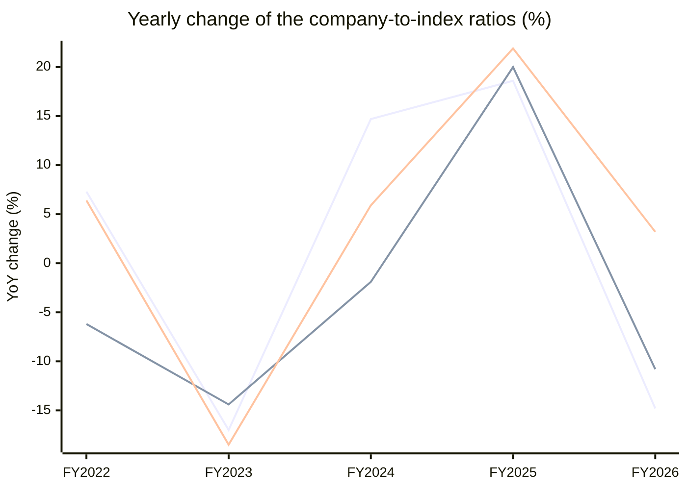

# Cams Services (CAMS) — Stock vs Nifty 50: price and earnings ratios

Every chart divides the company by the **Nifty 50** index, one point per fiscal year, up to the last 15 fiscal years. A **rising** line means the company outgrew the index on that measure; a **falling** line means it lagged. Index prices are real ^NSEI closes; index PAT and operating profit are the summed figures of the current 50 constituents from the stored statements (Mar 2015..Mar 2026) — today's membership, so older years carry a survivorship caveat.

## 1. Price ratio — company share price ÷ Nifty 50 (×1000 for readability)

**Verdict: MOVED WITH the index: the ratio changed only +3% across the window.**

```
FY2021  █████████████████████      25.239
FY2022  ███████████████████████    27.082  ▲ +7.3% vs prior year
FY2023  ███████████████████        22.485  ▼ -17.0% vs prior year
FY2024  ██████████████████████     25.797  ▲ +14.7% vs prior year
FY2025  ██████████████████████████ 30.602  ▲ +18.6% vs prior year
FY2026  ██████████████████████     26.078  ▼ -14.8% vs prior year
```


**Change over the standard windows**

| Window | From | To | Ratio change |
|---|---|---|---|
| last 15 years | FY2011 | FY2026 | n/a — data starts FY2021 |
| last 10 years | FY2016 | FY2026 | n/a — data starts FY2021 |
| last 5 years | FY2021 | FY2026 | +3% |
| last 3 years | FY2023 | FY2026 | +16% |
| last 1 year | FY2025 | FY2026 | -15% |


## 2. PAT ratio — company net profit ÷ index net profit (% of index)

**Verdict: MOVED WITH the index: the ratio changed only -7% across the window.**

```
FY2018  ███████████████████████    0.056%
FY2019  ███████████████████        0.046%  ▼ -16.9% vs prior year
FY2020  ██████████████████████████ 0.062%  ▲ +34.1% vs prior year
FY2021  ██████████████████████████ 0.062%  ▼ -0.9% vs prior year
FY2022  ████████████████████████   0.058%  ▼ -6.2% vs prior year
FY2023  █████████████████████      0.050%  ▼ -14.4% vs prior year
FY2024  ████████████████████       0.049%  ▼ -1.9% vs prior year
FY2025  ████████████████████████   0.058%  ▲ +20.0% vs prior year
FY2026  ██████████████████████     0.052%  ▼ -10.8% vs prior year
```


**Change over the standard windows**

| Window | From | To | Ratio change |
|---|---|---|---|
| last 15 years | FY2011 | FY2026 | n/a — data starts FY2018 |
| last 10 years | FY2016 | FY2026 | n/a — data starts FY2018 |
| last 5 years | FY2021 | FY2026 | -16% |
| last 3 years | FY2023 | FY2026 | +5% |
| last 1 year | FY2025 | FY2026 | -11% |


## 3. Operating-profit ratio — company operating profit ÷ index operating profit (% of index)

**Verdict: LAGGED the index: the ratio fell -13% from FY2018 to FY2026.**

```
FY2018  ██████████████████████████ 0.072%
FY2019  ████████████████████       0.055%  ▼ -24.3% vs prior year
FY2020  █████████████████████      0.058%  ▲ +6.6% vs prior year
FY2021  ████████████████████       0.055%  ▼ -6.6% vs prior year
FY2022  █████████████████████      0.058%  ▲ +6.4% vs prior year
FY2023  █████████████████          0.047%  ▼ -18.5% vs prior year
FY2024  ██████████████████         0.050%  ▲ +5.9% vs prior year
FY2025  ██████████████████████     0.061%  ▲ +21.9% vs prior year
FY2026  ███████████████████████    0.063%  ▲ +3.2% vs prior year
```


**Change over the standard windows**

| Window | From | To | Ratio change |
|---|---|---|---|
| last 15 years | FY2011 | FY2026 | n/a — data starts FY2018 |
| last 10 years | FY2016 | FY2026 | n/a — data starts FY2018 |
| last 5 years | FY2021 | FY2026 | +15% |
| last 3 years | FY2023 | FY2026 | +33% |
| last 1 year | FY2025 | FY2026 | +3% |


## 4. Yearly change of all three ratios — line graph

One line per ratio, one point per fiscal year: how much the company gained (+) or lost (−) on the index that year.



*line 1 = Price ratio · line 2 = PAT ratio · line 3 = Operating-profit ratio. A point above 0 means the company gained on the index that year; below 0 it lagged.*


---
*Generated by the StockToIndexPriceEarningsRatio skill. Research tooling — not investment advice.*
