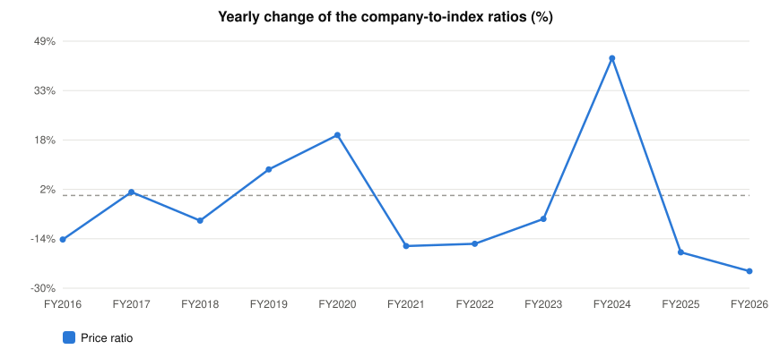

# Colgate Palmolive (India) Ltd. (COLPAL) — Stock vs Nifty 50: price and earnings ratios

Every chart divides the company by the **Nifty 50** index, one point per fiscal year, up to the last 15 fiscal years. A **rising** line means the company outgrew the index on that measure; a **falling** line means it lagged. Index prices are real ^NSEI closes; index PAT and operating profit are the summed figures of the current 50 constituents from the stored statements (Mar 2015..Mar 2026) — today's membership, so older years carry a survivorship caveat.

## 1. Price ratio — company share price ÷ Nifty 50 (×1000 for readability)

**Verdict: LAGGED the index: the ratio fell -39% from FY2015 to FY2026.**

```
FY2015  █████████████████████████  123.101
FY2016  ██████████████████████     105.843  ▼ -14.0% vs prior year
FY2017  ██████████████████████     106.996  ▲ +1.1% vs prior year
FY2018  ████████████████████       98.414  ▼ -8.0% vs prior year
FY2019  ██████████████████████     106.561  ▲ +8.3% vs prior year
FY2020  ██████████████████████████ 127.050  ▲ +19.2% vs prior year
FY2021  ██████████████████████     106.578  ▼ -16.1% vs prior year
FY2022  ██████████████████         90.177  ▼ -15.4% vs prior year
FY2023  █████████████████          83.440  ▼ -7.5% vs prior year
FY2024  █████████████████████████  119.901  ▲ +43.7% vs prior year
FY2025  ████████████████████       98.207  ▼ -18.1% vs prior year
FY2026  ███████████████            74.537  ▼ -24.1% vs prior year
```


**Change over the standard windows**

| Window | From | To | Ratio change |
|---|---|---|---|
| last 15 years | FY2011 | FY2026 | n/a — data starts FY2015 |
| last 10 years | FY2016 | FY2026 | -30% |
| last 5 years | FY2021 | FY2026 | -30% |
| last 3 years | FY2023 | FY2026 | -11% |
| last 1 year | FY2025 | FY2026 | -24% |


## 2. PAT ratio — company net profit ÷ index net profit (% of index)

**Verdict: too little overlapping data to call a trend.**

*(no overlapping years in the stored data)*


**Change over the standard windows**

*(too little data for window trends)*


## 3. Operating-profit ratio — company operating profit ÷ index operating profit (% of index)

**Verdict: too little overlapping data to call a trend.**

*(no overlapping years in the stored data)*


**Change over the standard windows**

*(too little data for window trends)*


## 4. Yearly change of all three ratios — line graph

One line per ratio, one point per fiscal year: how much the company gained (+) or lost (−) on the index that year.



*Lines: Price ratio. A point above 0 means the company gained on the index that year; below 0 it lagged.*


## Years the stored data could not cover

- Mar 2015: company Net Profit not in stored data
- Mar 2016: company Net Profit not in stored data
- Mar 2017: company Net Profit not in stored data
- Mar 2018: company Net Profit not in stored data
- Mar 2019: company Net Profit not in stored data
- Mar 2020: company Net Profit not in stored data
- Mar 2021: company Net Profit not in stored data
- Mar 2022: company Net Profit not in stored data
- Mar 2023: company Net Profit not in stored data
- Mar 2024: company Net Profit not in stored data
- Mar 2025: company Net Profit not in stored data
- Mar 2026: company Net Profit not in stored data


---
*Generated by the StockToIndexPriceEarningsRatio skill. Research tooling — not investment advice.*
