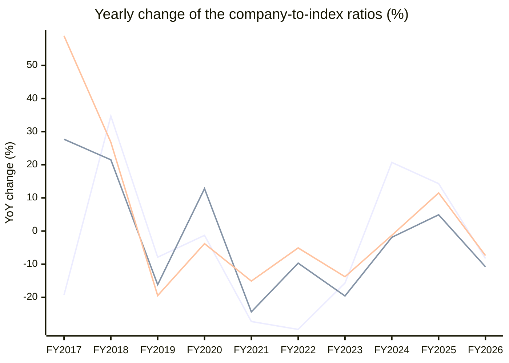

# Gillette India Ltd. (GILLETTE) — Stock vs Nifty 50: price and earnings ratios

Every chart divides the company by the **Nifty 50** index, one point per fiscal year, up to the last 15 fiscal years. A **rising** line means the company outgrew the index on that measure; a **falling** line means it lagged. Index prices are real ^NSEI closes; index PAT and operating profit are the summed figures of the current 50 constituents from the stored statements (Mar 2015..Mar 2026) — today's membership, so older years carry a survivorship caveat.

## 1. Price ratio — company share price ÷ Nifty 50 (×1000 for readability)

**Verdict: LAGGED the index: the ratio fell -48% from FY2015 to FY2026.**

```
FY2015  █████████████████████████  584.612
FY2016  ████████████████████████   562.053  ▼ -3.9% vs prior year
FY2017  ███████████████████        453.475  ▼ -19.3% vs prior year
FY2018  ██████████████████████████ 610.610  ▲ +34.7% vs prior year
FY2019  ████████████████████████   562.374  ▼ -7.9% vs prior year
FY2020  ████████████████████████   554.783  ▼ -1.3% vs prior year
FY2021  █████████████████          403.254  ▼ -27.3% vs prior year
FY2022  ████████████               283.563  ▼ -29.7% vs prior year
FY2023  ██████████                 238.921  ▼ -15.7% vs prior year
FY2024  ████████████               288.416  ▲ +20.7% vs prior year
FY2025  ██████████████             329.711  ▲ +14.3% vs prior year
FY2026  █████████████              302.260  ▼ -8.3% vs prior year
```


**Change over the standard windows**

| Window | From | To | Ratio change |
|---|---|---|---|
| last 15 years | FY2011 | FY2026 | n/a — data starts FY2015 |
| last 10 years | FY2016 | FY2026 | -46% |
| last 5 years | FY2021 | FY2026 | -25% |
| last 3 years | FY2023 | FY2026 | +27% |
| last 1 year | FY2025 | FY2026 | -8% |


## 2. PAT ratio — company net profit ÷ index net profit (% of index)

**Verdict: LAGGED the index: the ratio fell -26% from FY2016 to FY2026.**

```
FY2016  █████████████████          0.062%
FY2017  █████████████████████      0.080%  ▲ +27.7% vs prior year
FY2018  ██████████████████████████ 0.097%  ▲ +21.5% vs prior year
FY2019  ██████████████████████     0.081%  ▼ -16.2% vs prior year
FY2020  █████████████████████████  0.092%  ▲ +12.8% vs prior year
FY2021  ███████████████████        0.069%  ▼ -24.4% vs prior year
FY2022  █████████████████          0.063%  ▼ -9.7% vs prior year
FY2023  █████████████              0.050%  ▼ -19.6% vs prior year
FY2024  █████████████              0.049%  ▼ -1.9% vs prior year
FY2025  ██████████████             0.052%  ▲ +4.9% vs prior year
FY2026  ████████████               0.046%  ▼ -10.8% vs prior year
```


**Change over the standard windows**

| Window | From | To | Ratio change |
|---|---|---|---|
| last 15 years | FY2011 | FY2026 | n/a — data starts FY2016 |
| last 10 years | FY2016 | FY2026 | -26% |
| last 5 years | FY2021 | FY2026 | -33% |
| last 3 years | FY2023 | FY2026 | -8% |
| last 1 year | FY2025 | FY2026 | -11% |


## 3. Operating-profit ratio — company operating profit ÷ index operating profit (% of index)

**Verdict: GAINED on the index: the ratio rose +10% from FY2016 to FY2026.**

```
FY2016  █████████████              0.050%
FY2017  █████████████████████      0.080%  ▲ +58.9% vs prior year
FY2018  ██████████████████████████ 0.101%  ▲ +26.8% vs prior year
FY2019  █████████████████████      0.081%  ▼ -19.5% vs prior year
FY2020  ████████████████████       0.078%  ▼ -3.8% vs prior year
FY2021  █████████████████          0.066%  ▼ -15.1% vs prior year
FY2022  ████████████████           0.063%  ▼ -5.1% vs prior year
FY2023  ██████████████             0.054%  ▼ -13.8% vs prior year
FY2024  ██████████████             0.054%  ▼ -1.3% vs prior year
FY2025  ███████████████            0.060%  ▲ +11.5% vs prior year
FY2026  ██████████████             0.055%  ▼ -7.4% vs prior year
```


**Change over the standard windows**

| Window | From | To | Ratio change |
|---|---|---|---|
| last 15 years | FY2011 | FY2026 | n/a — data starts FY2016 |
| last 10 years | FY2016 | FY2026 | +10% |
| last 5 years | FY2021 | FY2026 | -17% |
| last 3 years | FY2023 | FY2026 | +2% |
| last 1 year | FY2025 | FY2026 | -7% |


## 4. Yearly change of all three ratios — line graph

One line per ratio, one point per fiscal year: how much the company gained (+) or lost (−) on the index that year.



*line 1 = Price ratio · line 2 = PAT ratio · line 3 = Operating-profit ratio. A point above 0 means the company gained on the index that year; below 0 it lagged.*


## Years the stored data could not cover

- Mar 2015: company Net Profit not in stored data


---
*Generated by the StockToIndexPriceEarningsRatio skill. Research tooling — not investment advice.*
