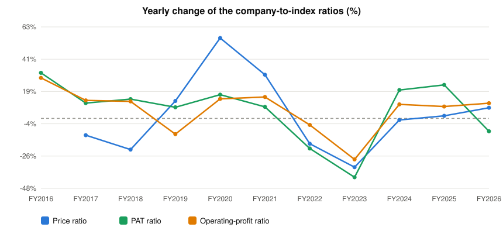

# Dr. Lal Path Labs Ltd. (LALPATHLAB) — Stock vs Nifty 50: price and earnings ratios

Every chart divides the company by the **Nifty 50** index, one point per fiscal year, up to the last 15 fiscal years. A **rising** line means the company outgrew the index on that measure; a **falling** line means it lagged. Index prices are real ^NSEI closes; index PAT and operating profit are the summed figures of the current 50 constituents from the stored statements (Mar 2015..Mar 2026) — today's membership, so older years carry a survivorship caveat.

## 1. Price ratio — company share price ÷ Nifty 50 (×1000 for readability)

**Verdict: MOVED WITH the index: the ratio changed only -7% across the window.**

```
FY2016  █████████████████          58.810
FY2017  ███████████████            51.996  ▼ -11.6% vs prior year
FY2018  ███████████                40.799  ▼ -21.5% vs prior year
FY2019  █████████████              45.714  ▲ +12.0% vs prior year
FY2020  ████████████████████       71.081  ▲ +55.5% vs prior year
FY2021  ██████████████████████████ 92.510  ▲ +30.1% vs prior year
FY2022  █████████████████████      76.325  ▼ -17.5% vs prior year
FY2023  ██████████████             50.598  ▼ -33.7% vs prior year
FY2024  ██████████████             50.053  ▼ -1.1% vs prior year
FY2025  ██████████████             50.932  ▲ +1.8% vs prior year
FY2026  ███████████████            54.676  ▲ +7.4% vs prior year
```


**Change over the standard windows**

| Window | From | To | Ratio change |
|---|---|---|---|
| last 15 years | FY2011 | FY2026 | n/a — data starts FY2016 |
| last 10 years | FY2016 | FY2026 | -7% |
| last 5 years | FY2021 | FY2026 | -41% |
| last 3 years | FY2023 | FY2026 | +8% |
| last 1 year | FY2025 | FY2026 | +7% |


## 2. PAT ratio — company net profit ÷ index net profit (% of index)

**Verdict: GAINED on the index: the ratio rose +41% from FY2015 to FY2026.**

```
FY2015  ████████████               0.040%
FY2016  ███████████████            0.053%  ▲ +31.5% vs prior year
FY2017  █████████████████          0.058%  ▲ +10.6% vs prior year
FY2018  ███████████████████        0.066%  ▲ +13.3% vs prior year
FY2019  █████████████████████      0.071%  ▲ +7.7% vs prior year
FY2020  ████████████████████████   0.083%  ▲ +16.4% vs prior year
FY2021  ██████████████████████████ 0.089%  ▲ +8.0% vs prior year
FY2022  █████████████████████      0.071%  ▼ -20.8% vs prior year
FY2023  ████████████               0.042%  ▼ -40.6% vs prior year
FY2024  ███████████████            0.050%  ▲ +19.6% vs prior year
FY2025  ██████████████████         0.062%  ▲ +23.2% vs prior year
FY2026  ████████████████           0.056%  ▼ -8.9% vs prior year
```


**Change over the standard windows**

| Window | From | To | Ratio change |
|---|---|---|---|
| last 15 years | FY2011 | FY2026 | n/a — data starts FY2015 |
| last 10 years | FY2016 | FY2026 | +7% |
| last 5 years | FY2021 | FY2026 | -37% |
| last 3 years | FY2023 | FY2026 | +34% |
| last 1 year | FY2025 | FY2026 | -9% |


## 3. Operating-profit ratio — company operating profit ÷ index operating profit (% of index)

**Verdict: GAINED on the index: the ratio rose +68% from FY2015 to FY2026.**

```
FY2015  ██████████████             0.043%
FY2016  ██████████████████         0.055%  ▲ +28.0% vs prior year
FY2017  ████████████████████       0.062%  ▲ +12.4% vs prior year
FY2018  ██████████████████████     0.069%  ▲ +11.8% vs prior year
FY2019  ████████████████████       0.062%  ▼ -10.9% vs prior year
FY2020  ███████████████████████    0.070%  ▲ +13.5% vs prior year
FY2021  ██████████████████████████ 0.080%  ▲ +14.8% vs prior year
FY2022  █████████████████████████  0.077%  ▼ -4.5% vs prior year
FY2023  ██████████████████         0.055%  ▼ -28.3% vs prior year
FY2024  ████████████████████       0.060%  ▲ +9.7% vs prior year
FY2025  █████████████████████      0.065%  ▲ +8.2% vs prior year
FY2026  ███████████████████████    0.072%  ▲ +10.5% vs prior year
```


**Change over the standard windows**

| Window | From | To | Ratio change |
|---|---|---|---|
| last 15 years | FY2011 | FY2026 | n/a — data starts FY2015 |
| last 10 years | FY2016 | FY2026 | +31% |
| last 5 years | FY2021 | FY2026 | -10% |
| last 3 years | FY2023 | FY2026 | +31% |
| last 1 year | FY2025 | FY2026 | +10% |


## 4. Yearly change of all three ratios — line graph

One line per ratio, one point per fiscal year: how much the company gained (+) or lost (−) on the index that year.



*Lines: Price ratio · PAT ratio · Operating-profit ratio. A point above 0 means the company gained on the index that year; below 0 it lagged.*


---
*Generated by the StockToIndexPriceEarningsRatio skill. Research tooling — not investment advice.*
