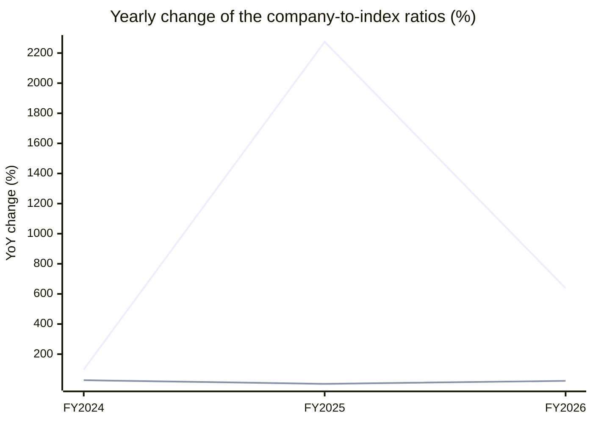

# Leela Palaces Hotels (THELEELA) — Stock vs Nifty 50: price and earnings ratios

Every chart divides the company by the **Nifty 50** index, one point per fiscal year, up to the last 15 fiscal years. A **rising** line means the company outgrew the index on that measure; a **falling** line means it lagged. Index prices are real ^NSEI closes; index PAT and operating profit are the summed figures of the current 50 constituents from the stored statements (Mar 2015..Mar 2026) — today's membership, so older years carry a survivorship caveat.

## 1. Price ratio — company share price ÷ Nifty 50 (×1000 for readability)

**Verdict: too little overlapping data to call a trend.**

```
FY2026  ██████████████████████████ 17.068
```


**Change over the standard windows**

*(too little data for window trends)*


## 2. PAT ratio — company net profit ÷ index net profit (% of index)

**Verdict: TURNED AROUND against the index: from a loss in FY2023 to a positive share of the index by FY2026.**

```
FY2023  ▒▒▒▒▒▒                     -0.011%
FY2024  ▒                          -0.000%  ▲ +97.4% vs prior year
FY2025  ████                       0.006%  ▲ +2274.7% vs prior year
FY2026  ██████████████████████████ 0.044%  ▲ +637.9% vs prior year
```


**Change over the standard windows**

| Window | From | To | Ratio change |
|---|---|---|---|
| last 15 years | FY2011 | FY2026 | n/a — data starts FY2023 |
| last 10 years | FY2016 | FY2026 | n/a — data starts FY2023 |
| last 5 years | FY2021 | FY2026 | n/a — data starts FY2023 |
| last 3 years | FY2023 | FY2026 | turned from loss to profit share |
| last 1 year | FY2025 | FY2026 | +638% |


## 3. Operating-profit ratio — company operating profit ÷ index operating profit (% of index)

**Verdict: GAINED on the index: the ratio rose +59% from FY2023 to FY2026.**

```
FY2023  ████████████████           0.043%
FY2024  █████████████████████      0.054%  ▲ +26.9% vs prior year
FY2025  █████████████████████      0.056%  ▲ +2.5% vs prior year
FY2026  ██████████████████████████ 0.068%  ▲ +22.5% vs prior year
```


**Change over the standard windows**

| Window | From | To | Ratio change |
|---|---|---|---|
| last 15 years | FY2011 | FY2026 | n/a — data starts FY2023 |
| last 10 years | FY2016 | FY2026 | n/a — data starts FY2023 |
| last 5 years | FY2021 | FY2026 | n/a — data starts FY2023 |
| last 3 years | FY2023 | FY2026 | +59% |
| last 1 year | FY2025 | FY2026 | +22% |


## 4. Yearly change of all three ratios — line graph

One line per ratio, one point per fiscal year: how much the company gained (+) or lost (−) on the index that year.



*line 1 = PAT ratio · line 2 = Operating-profit ratio. A point above 0 means the company gained on the index that year; below 0 it lagged.*


---
*Generated by the StockToIndexPriceEarningsRatio skill. Research tooling — not investment advice.*
