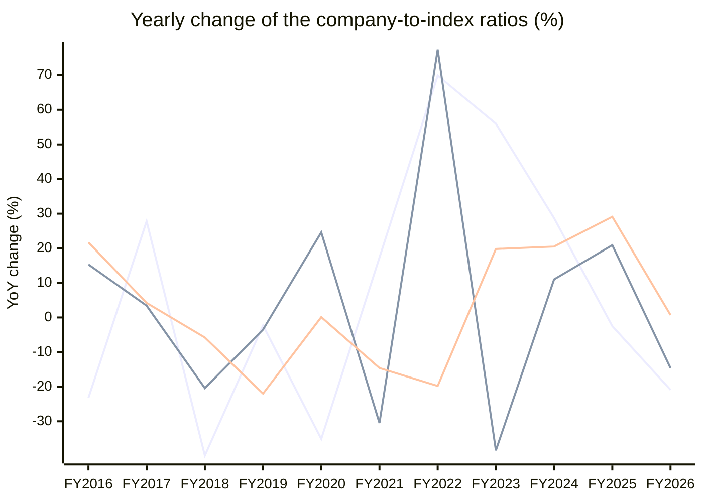

# Triveni Turbine Ltd. (TRITURBINE) — Stock vs Nifty 50: price and earnings ratios

Every chart divides the company by the **Nifty 50** index, one point per fiscal year, up to the last 15 fiscal years. A **rising** line means the company outgrew the index on that measure; a **falling** line means it lagged. Index prices are real ^NSEI closes; index PAT and operating profit are the summed figures of the current 50 constituents from the stored statements (Mar 2015..Mar 2026) — today's membership, so older years carry a survivorship caveat.

## 1. Price ratio — company share price ÷ Nifty 50 (×1000 for readability)

**Verdict: GAINED on the index: the ratio rose +15% from FY2015 to FY2026.**

```
FY2015  █████████████████          15.871
FY2016  █████████████              12.185  ▼ -23.2% vs prior year
FY2017  █████████████████          15.574  ▲ +27.8% vs prior year
FY2018  ██████████                 9.358  ▼ -39.9% vs prior year
FY2019  ██████████                 9.146  ▼ -2.3% vs prior year
FY2020  ██████                     5.933  ▼ -35.1% vs prior year
FY2021  ████████                   6.958  ▲ +17.3% vs prior year
FY2022  █████████████              11.820  ▲ +69.9% vs prior year
FY2023  ████████████████████       18.442  ▲ +56.0% vs prior year
FY2024  ██████████████████████████ 23.743  ▲ +28.7% vs prior year
FY2025  █████████████████████████  23.161  ▼ -2.5% vs prior year
FY2026  ████████████████████       18.329  ▼ -20.9% vs prior year
```


**Change over the standard windows**

| Window | From | To | Ratio change |
|---|---|---|---|
| last 15 years | FY2011 | FY2026 | n/a — data starts FY2015 |
| last 10 years | FY2016 | FY2026 | +50% |
| last 5 years | FY2021 | FY2026 | +163% |
| last 3 years | FY2023 | FY2026 | -1% |
| last 1 year | FY2025 | FY2026 | -21% |


## 2. PAT ratio — company net profit ÷ index net profit (% of index)

**Verdict: MOVED WITH the index: the ratio changed only -1% across the window.**

```
FY2015  ██████████████████         0.039%
FY2016  █████████████████████      0.045%  ▲ +15.3% vs prior year
FY2017  ██████████████████████     0.046%  ▲ +3.4% vs prior year
FY2018  ██████████████████         0.037%  ▼ -20.4% vs prior year
FY2019  █████████████████          0.035%  ▼ -3.5% vs prior year
FY2020  █████████████████████      0.044%  ▲ +24.6% vs prior year
FY2021  ███████████████            0.031%  ▼ -30.5% vs prior year
FY2022  ██████████████████████████ 0.055%  ▲ +77.4% vs prior year
FY2023  ████████████████           0.034%  ▼ -38.4% vs prior year
FY2024  ██████████████████         0.037%  ▲ +11.0% vs prior year
FY2025  ██████████████████████     0.045%  ▲ +20.9% vs prior year
FY2026  ██████████████████         0.039%  ▼ -14.6% vs prior year
```


**Change over the standard windows**

| Window | From | To | Ratio change |
|---|---|---|---|
| last 15 years | FY2011 | FY2026 | n/a — data starts FY2015 |
| last 10 years | FY2016 | FY2026 | -14% |
| last 5 years | FY2021 | FY2026 | +25% |
| last 3 years | FY2023 | FY2026 | +15% |
| last 1 year | FY2025 | FY2026 | -15% |


## 3. Operating-profit ratio — company operating profit ÷ index operating profit (% of index)

**Verdict: GAINED on the index: the ratio rose +20% from FY2015 to FY2026.**

```
FY2015  █████████████████████      0.034%
FY2016  █████████████████████████  0.042%  ▲ +21.7% vs prior year
FY2017  ██████████████████████████ 0.044%  ▲ +4.2% vs prior year
FY2018  ████████████████████████   0.041%  ▼ -5.8% vs prior year
FY2019  ███████████████████        0.032%  ▼ -22.0% vs prior year
FY2020  ███████████████████        0.032%  ▬ +0.1% vs prior year
FY2021  ████████████████           0.027%  ▼ -14.6% vs prior year
FY2022  █████████████              0.022%  ▼ -19.8% vs prior year
FY2023  ████████████████           0.026%  ▲ +19.8% vs prior year
FY2024  ███████████████████        0.032%  ▲ +20.5% vs prior year
FY2025  ████████████████████████   0.041%  ▲ +29.1% vs prior year
FY2026  █████████████████████████  0.041%  ▲ +0.7% vs prior year
```


**Change over the standard windows**

| Window | From | To | Ratio change |
|---|---|---|---|
| last 15 years | FY2011 | FY2026 | n/a — data starts FY2015 |
| last 10 years | FY2016 | FY2026 | -1% |
| last 5 years | FY2021 | FY2026 | +51% |
| last 3 years | FY2023 | FY2026 | +57% |
| last 1 year | FY2025 | FY2026 | +1% |


## 4. Yearly change of all three ratios — line graph

One line per ratio, one point per fiscal year: how much the company gained (+) or lost (−) on the index that year.



*line 1 = Price ratio · line 2 = PAT ratio · line 3 = Operating-profit ratio. A point above 0 means the company gained on the index that year; below 0 it lagged.*


---
*Generated by the StockToIndexPriceEarningsRatio skill. Research tooling — not investment advice.*
