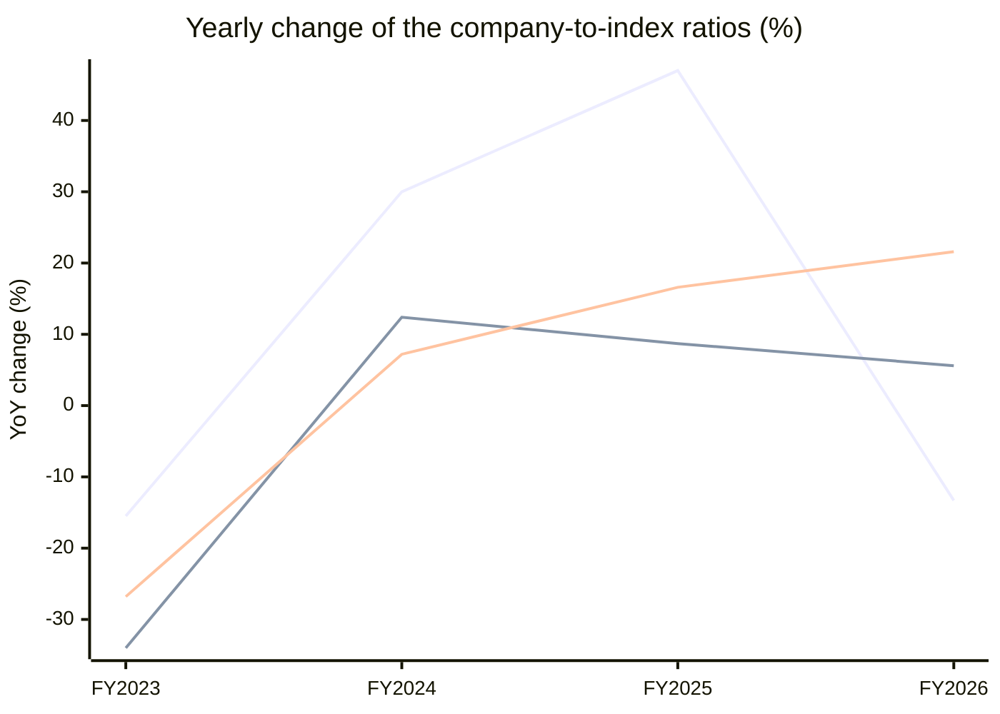

# Vijaya Diagnost. (VIJAYA) — Stock vs Nifty 50: price and earnings ratios

Every chart divides the company by the **Nifty 50** index, one point per fiscal year, up to the last 15 fiscal years. A **rising** line means the company outgrew the index on that measure; a **falling** line means it lagged. Index prices are real ^NSEI closes; index PAT and operating profit are the summed figures of the current 50 constituents from the stored statements (Mar 2015..Mar 2026) — today's membership, so older years carry a survivorship caveat.

## 1. Price ratio — company share price ÷ Nifty 50 (×1000 for readability)

**Verdict: GAINED on the index: the ratio rose +40% from FY2022 to FY2026.**

```
FY2022  ████████████████           25.619
FY2023  ██████████████             21.661  ▼ -15.5% vs prior year
FY2024  ██████████████████         28.162  ▲ +30.0% vs prior year
FY2025  ██████████████████████████ 41.390  ▲ +47.0% vs prior year
FY2026  ███████████████████████    35.895  ▼ -13.3% vs prior year
```


**Change over the standard windows**

| Window | From | To | Ratio change |
|---|---|---|---|
| last 15 years | FY2011 | FY2026 | n/a — data starts FY2022 |
| last 10 years | FY2016 | FY2026 | n/a — data starts FY2022 |
| last 5 years | FY2021 | FY2026 | n/a — data starts FY2022 |
| last 3 years | FY2023 | FY2026 | +66% |
| last 1 year | FY2025 | FY2026 | -13% |


## 2. PAT ratio — company net profit ÷ index net profit (% of index)

**Verdict: GAINED on the index: the ratio rose +42% from FY2018 to FY2026.**

```
FY2018  ██████████████             0.013%
FY2019  █████████████████          0.016%  ▲ +21.7% vs prior year
FY2020  ███████████████████████    0.023%  ▲ +39.9% vs prior year
FY2021  ██████████████████████████ 0.026%  ▲ +12.2% vs prior year
FY2022  ███████████████████████    0.022%  ▼ -12.5% vs prior year
FY2023  ███████████████            0.015%  ▼ -34.0% vs prior year
FY2024  █████████████████          0.017%  ▲ +12.4% vs prior year
FY2025  ██████████████████         0.018%  ▲ +8.7% vs prior year
FY2026  ███████████████████        0.019%  ▲ +5.6% vs prior year
```


**Change over the standard windows**

| Window | From | To | Ratio change |
|---|---|---|---|
| last 15 years | FY2011 | FY2026 | n/a — data starts FY2018 |
| last 10 years | FY2016 | FY2026 | n/a — data starts FY2018 |
| last 5 years | FY2021 | FY2026 | -25% |
| last 3 years | FY2023 | FY2026 | +29% |
| last 1 year | FY2025 | FY2026 | +6% |


## 3. Operating-profit ratio — company operating profit ÷ index operating profit (% of index)

**Verdict: GAINED on the index: the ratio rose +48% from FY2018 to FY2026.**

```
FY2018  ██████████████████         0.021%
FY2019  ███████████████████        0.023%  ▲ +8.1% vs prior year
FY2020  ███████████████████████    0.027%  ▲ +19.4% vs prior year
FY2021  ██████████████████████████ 0.031%  ▲ +13.0% vs prior year
FY2022  ███████████████████████    0.028%  ▼ -8.8% vs prior year
FY2023  █████████████████          0.020%  ▼ -26.8% vs prior year
FY2024  ██████████████████         0.022%  ▲ +7.2% vs prior year
FY2025  █████████████████████      0.026%  ▲ +16.6% vs prior year
FY2026  ██████████████████████████ 0.031%  ▲ +21.6% vs prior year
```


**Change over the standard windows**

| Window | From | To | Ratio change |
|---|---|---|---|
| last 15 years | FY2011 | FY2026 | n/a — data starts FY2018 |
| last 10 years | FY2016 | FY2026 | n/a — data starts FY2018 |
| last 5 years | FY2021 | FY2026 | +1% |
| last 3 years | FY2023 | FY2026 | +52% |
| last 1 year | FY2025 | FY2026 | +22% |


## 4. Yearly change of all three ratios — line graph

One line per ratio, one point per fiscal year: how much the company gained (+) or lost (−) on the index that year.



*line 1 = Price ratio · line 2 = PAT ratio · line 3 = Operating-profit ratio. A point above 0 means the company gained on the index that year; below 0 it lagged.*


---
*Generated by the StockToIndexPriceEarningsRatio skill. Research tooling — not investment advice.*
