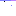

# render probe

### A_md_img_dataURI_png


### B_html_img_dataURI_png


### C_md_img_dataURI_svg


### D_raw_inline_svg
<svg xmlns="http://www.w3.org/2000/svg" width="16" height="16"><rect width="16" height="16" fill="red"/></svg>

### E_mermaid_xychart
```mermaid
xychart-beta
    title "probe"
    x-axis [a, b, c]
    line [1, 3, 2]
```

### F_relative_png

